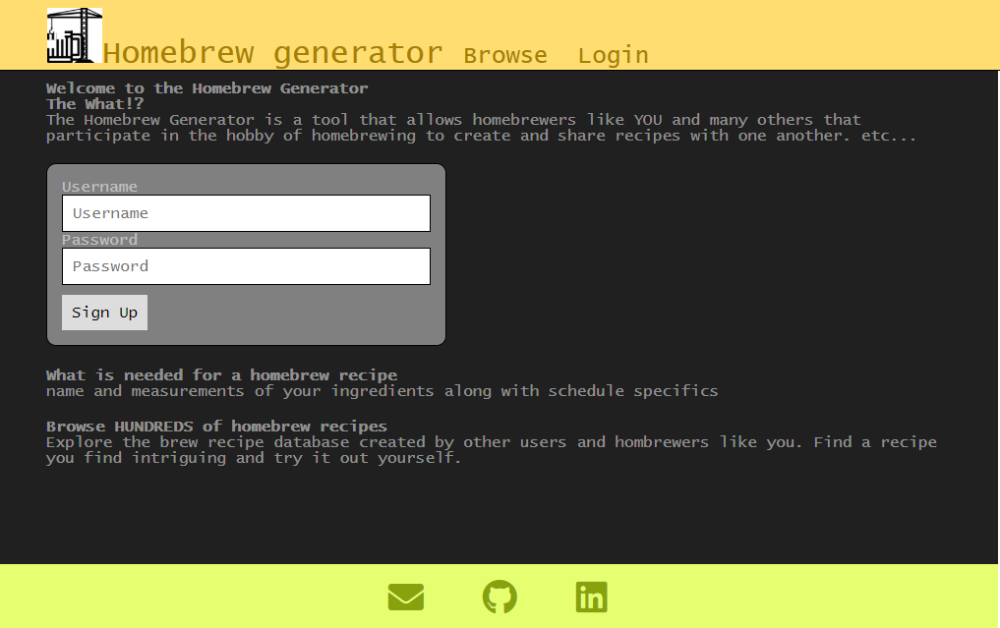
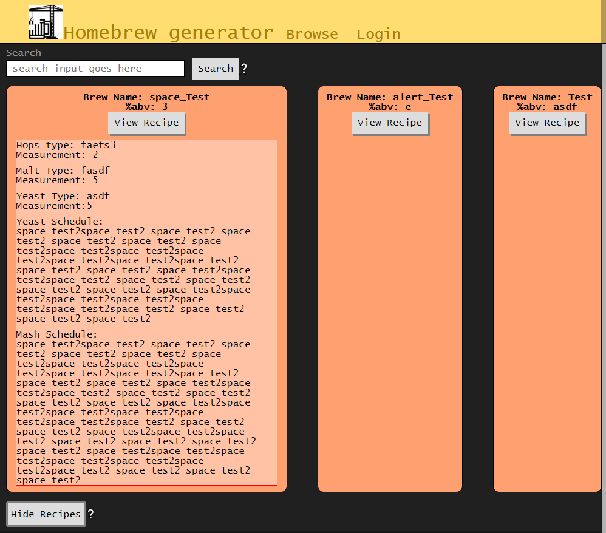
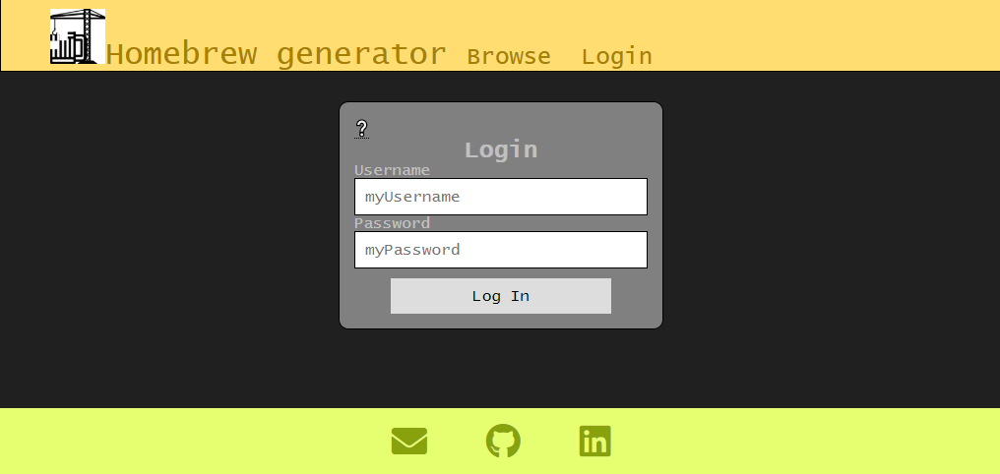
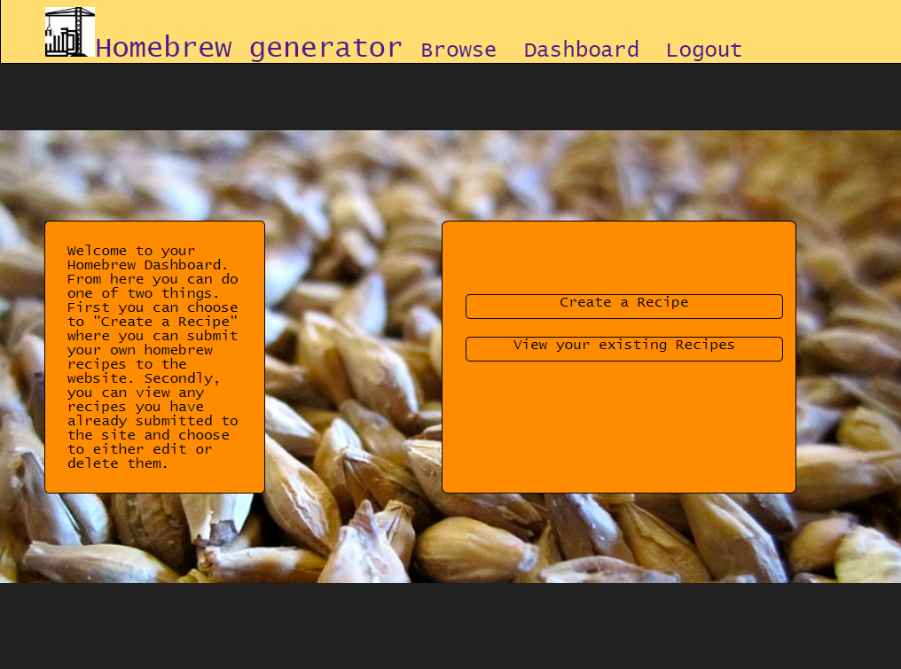
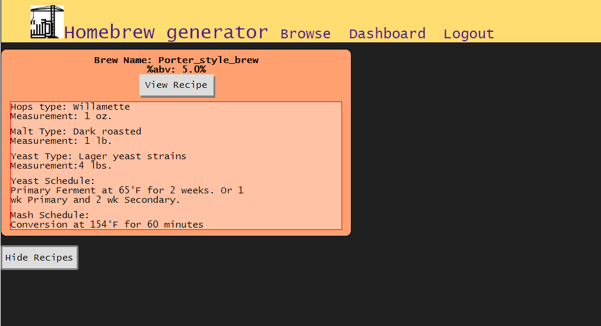

# Homebrew Recipe generator (React)

## Description
The main goal of the homebrew recipe generator is to allow for the sharing
and promoting of brew recipes created by and shared between fellow
homebrewers

### Active demo
https://homebrew-recipe-generator-reac.herokuapp.com/

## User Stories
 - As a visiter, I should be able to create an account
 - As a registered user, I should be able to login with my account
 - As a registered user, I should be able to logout with my account
 - As a registered user, I should be able to create a brew recipe
 - As a registered user, I should be able to post my brew recipes to a brew database
 - As a registered user or visitor, I should be able to browse the recipe database for other recipes
 - As a registered user or visitor, I should be able to use keywords to find a specific brew
 - As a registered user or visitor, I should be able to view a recipe of a brew from the results list generated by the browser
 - As a registered user, I should be able to delete my recipes

## Wireframes
Landing Page View

Browser Page View

Login Page View

Dashboard Page View

Create Recipe Page View

Archive Page View

## Userflow
The user will begin on the Landing page in a "Logged Out" version of the
site with the immediate option to sign up and create an account.  If this user
does not wish to create an account they can visit the browser page to search
for different type of existing brew recipes.  Or if the user already has an
account created, they can go to the login page and log in to their account from
there.  If the user decide to create an account, if their input meets the conditions for a valid
account, they will be immediately logged in.  This will render the "Logged In"
version of the site.  They will then have access to the dashboard page, which
from there allows users access to both the recipe creation page and their recipe
archive page.  When a user is done they will log out by simple clicking the
"Log Out" link in the navigation bar and will be sent back to the login page.

## Functionality
 - Users will have the ability to create their own account for the website
 - Users will be able to generate their own homebrew recipes for the websites database
    and subsequently 'POST' them
 - Users will be able to browse all recipes posted to the database and select them in order to
    view them
        
## Business Objects 

 - User (collection)
    - username
	- password
	- id

 - Brew (collection)
	- name (title)
	- abv% (calculated frontend/known)
	- id
	- userId

 - Malts types (collection)
	- type name
	- measurements (value in lbs.)
	- brewId

 - Hops Types (collection)
	- type name
	- measurements (value in lbs.)
	- brewId

 - Yeast (one type instance) (collection)
	- yeast name
	- measure (value in oz.)
	- brewId

 - Yeast (multiple type instance)
	- yeast name
	- schedule (textarea input)
	- brewId

 - Mash (collection)
	- schedule (textarea input)
	- brewId
    
## API enpoint purposes

### Brew Router
#### GET
    '/getArchive/:id':
            parses database for current user's id and retrieves all
            brews that have the matching user id value.

    '/viewBrew/:id':
            parses for and retrieves all parts of the selected brew
            to be viewed either on the browser page or archive page.

    '/get-all':
            retrieves all brews currently in the database

    '/get-one/:keyword':
            retrieves all brews that have a brewName value that
            includes the string value provided by the user's 
            search input

#### DELETE
    '/deleteRecipe/:id':
            removes the requested brew and respective recipe elements
            from the database. (to be implemented further down development)

#### PUT
    '/:id':
            updates values of requested brew recipe with values given by the user

#### POST
    '/':
            posts a brew and its respective recipe elements to the 
            database

### User Router
#### GET
    '/':
            retrieves all existing users from the database 

    '/:id':
            retrieves a single user with the matching given user id

#### DELETE
    there are no DELETE enpoints

#### PUT
    there are not PUT enpoints

#### POST
    '/':
            creates a new user in database after user has singed up for
            the site.
                
### Auth Router
#### GET
    "/userLoggedIn":
            retireves a list of users that are currently logged into the site

#### DELETE
    "/userLoggedIn"
            removes a user from the logged in list after logging out

#### PUT
    There are no PUT endpoints
#### POST
    '/login':
            creates an authToken for the user to verify their logged in status on the site

    '/refresh':
            refreshes a users authToken in the event of authToken expiration in order to perserver the user's "logged in" status

    "/userLoggedIn":
            addes the user to the list of logged in users so it can be accessed in by the other respective endpoints

## Accesibility
accessiblity of this app was confimed by the use of aXe software

## Technical
Homebrew-recipe-generator was built with:

### Front end
    - HTML5
    - CSS
    - Javascript
    - jQuery
    - Reactjs
    - Enzyme
    
### Back end
    - Node.js
    - Mongoose.js
    - Express
    - Morgan
    - Mocha and Chai (for testing yet to be implemented)
    - mLab database

## Roadmap
- Allowing users to comment on and like a brew recipes
- Allow users to like/dislike brews found by the browser
- Allow users to edit their already existing recipes
- Allow users to delete their recipes

## Typical Commands for Node.js and React.js
### React command lines
    - npm intall ==> install all node modules
    - npm start ==> run react server on http://localhost:3000
    
### Node command lines
    - npm install ==> install all node modules
    - npm nodemon ==> run node server