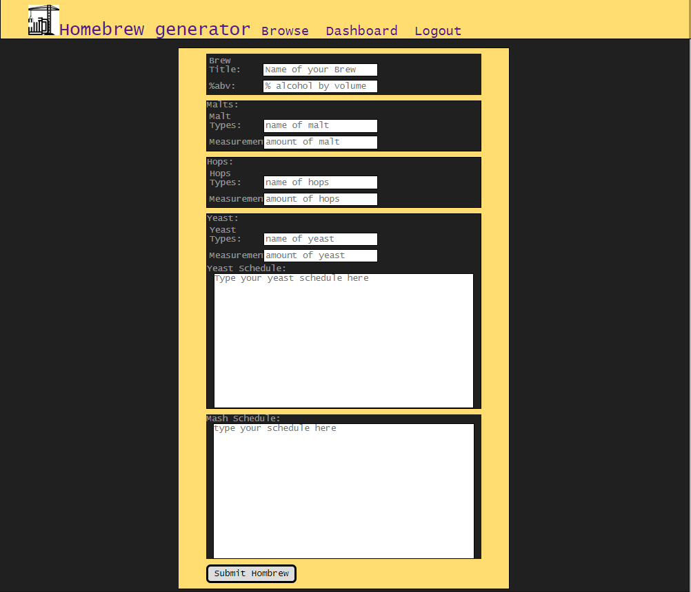

# Homebrew Recipe generator (React)

## Description
The main goal of the homebrew recipe generator is to allow for the sharing
and promoting of brew recipes created by and shared between fellow
homebrewers

### Active demo

## User Stories
 - As a visiter, I should be able to create an account
 - As a registered user, I should be able to login with my account
 - As a registered user, I should be able to logout with my account
 - As a registered user, I should be able to create a brew recipe
 - As a registered user, I should be able to post my brew recipes to a brew database
 - As a registered user or visitor, I should be able to browse the recipe database for other recipes
 - As a registered user or visitor, I should be able to use keywords to find a specific brew
 - As a registered user or visitor, I should be able to view a recipe of a brew from the results list generated by the browser
 - As a registered user, I should be able to delete my recipes

## Wireframes
Landing Page View

Browser Page View

Login Page View

Dashboard Page View

Create Recipe Page View

Archive Page View

## Userflow

## Functionality
 - Users will have the ability to create their own account for the website
 - Users will be able to generate their own homebrew recipes for the websites database
    and subsequently 'POST' them
 - Users will be able to browse all recipes posted to the database and select them in order to
    view them

## Look and Feel
(insert screenshots of website pages)
Color palette ideas:
    - summer palettes
        - yellow/orange
        
## Business Objects 

 - User (collection)
	- password
	- firstname
	- lastname
	- id

 - Homebrew (collection)
	- name (title)
	- abv% (calculated frontend/known)
	- brewid
	- userId

 - Malts types (collection)
	- type name
	- measurements (value in oz.)
	- brewId

 - Hops Types (collection)
	- type name
	- measurements (value in oz.)
	- brewId

 - Yeast (one type instance) (collection)
	- yeast name
	- schedule (textarea input)
	- brewId

 - Yeast (multiple type instance)
	- yeast name
	- schedule (textarea input)
	- brewId

 - Mash (collection)
	- schedule (textarea input)
	- brewId

## Responsiveness
App is responsive across most mobile, tablet, laptop, and desktop screen resolutions.
(include images of website pages in responsive format)

## Accesibility
accessiblity of this app was confimed by the use of aXe software

## Technical
Homebrew-recipe-generator was built with:

### Front end
    - HTML5
    - CSS
    - Javascript
    - jQuery
    - Reactjs
    
### Back end
    - Node.js
    - Mongoose.js
    - Express
    - Morgan
    - Mocha and Chai (for testing yet to be implemented)
    - mLab database

## Roadmap
(include discussions of ambitious impovemnent and thoughts of monotization of website)
- Allowing users to comment on and like a brew recipes
- Allow users to like/dislike brews found by the browser

## Typical Commands for Node.js and React.js
### React command lines
    - npm intall ==> install all node modules
    - npm start ==> run react server on http://localhost:3000
    
### Node command lines
    - npm install ==> install all node modules
    - npm nodemon ==> run node server